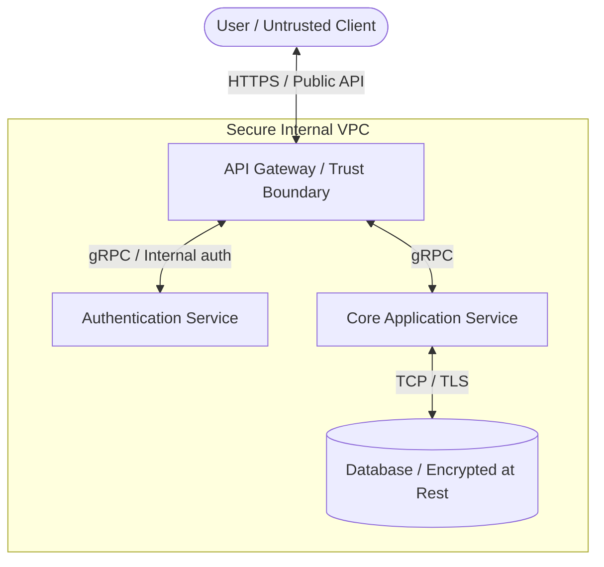

# Threat Model & Secure Architecture Specification

## Project: Aegis-Secured-Project
**Author**: `ssdlc_planner` (Agent)
**Date**: [Insert Timestamp]
**Scope**: [Describe Feature / Scope]

---

## 1. Executive Summary & Design Goals
*Provide a high-level summary of the feature, system changes, and main security objectives.*

---

## 2. System Architecture & Trust Boundaries
*Visualize and document the boundaries between systems, processes, and network zones.*

### Trust Boundary Analysis
| Trust Boundary ID | Source | Target | Transport | Security Controls (Encryption, Auth) |
|---|---|---|---|---|
| TB-1 | User | API Gateway | HTTPS (TLS 1.3) | Public interface, JWT authentication required |
| TB-2 | API Gateway | App Service | mTLS / gRPC | Internal service mesh authorization |
| TB-3 | App Service | Database | TCP / TLS | Database password in Vault, TLS transport |

---

## 3. Data Classification & Asset Inventory
*Classify data flowing through the application to enforce proper access control.*

| Asset ID | Asset Name | Description | Classification (Confidential / Public / Restricted) |
|---|---|---|---|
| AST-1 | User Passwords | Salted bcrypt passwords in DB | Restricted (Extremely Sensitive) |
| AST-2 | JWT Auth Tokens | User session tokens | Confidential |
| AST-3 | User Profiles | Email, name, and preferences | Confidential |

---

## 4. STRIDE Threat Analysis
*Identify threats using the STRIDE methodology.*

### **S**poofing (Identity)
* **Threat**: [e.g., Attacker spoofing JWT tokens to act as another user.]
* **Impact**: Critical - full account takeover.
* **Mitigation**: [e.g., Cryptographically sign JWTs using asymmetric ES256 keys, short-lived tokens, enforce token revocation.]

### **T**ampering (Data Integrity)
* **Threat**: [e.g., Parameter tampering on public APIs to view other users' profiles.]
* **Impact**: High - unauthorized data leakage.
* **Mitigation**: [e.g., Implement strict server-side resource-level authorization checks.]

### **R**epudiation (Non-repudiation)
* **Threat**: [e.g., User deletes sensitive audit logs or denies performing an administrative action.]
* **Impact**: Medium - lack of traceability.
* **Mitigation**: [e.g., Send immutable audit trails directly to a centralized logging server.]

### **I**nformation Disclosure (Confidentiality)
* **Threat**: [e.g., Debug stack traces and database errors are returned in raw JSON responses.]
* **Impact**: Medium - information leakage about infrastructure.
* **Mitigation**: [e.g., Universal global error catchers that sanitize responses and log internally.]

### **D**enial of Service (Availability)
* **Threat**: [e.g., High-frequency API polling exhausts DB connection pools.]
* **Impact**: High - service outage.
* **Mitigation**: [e.g., Implement IP-based and token-based rate limiting via Redis.]

### **E**levation of Privilege (Authorization)
* **Threat**: [e.g., Modifying standard user role to Admin in custom requests.]
* **Impact**: Critical - full system compromise.
* **Mitigation**: [e.g., Role membership checks done strictly server-side using claims, not client-supplied values.]

---

## 5. Security Requirements Checklist
*Actionable checklists passed to `ssdlc_coder` and `ssdlc_reviewer` to verify compliance.*

- [ ] **REQ-1**: Input validation using strict schemas (no HTML/SQL injection).
- [ ] **REQ-2**: Secure password storage using argon2 or bcrypt with cost >= 12.
- [ ] **REQ-3**: CSRF protection enabled on all state-changing endpoints.
- [ ] **REQ-4**: Sensitive configurations (DB URI, API keys) must be loaded strictly from environment variables, never hardcoded.
